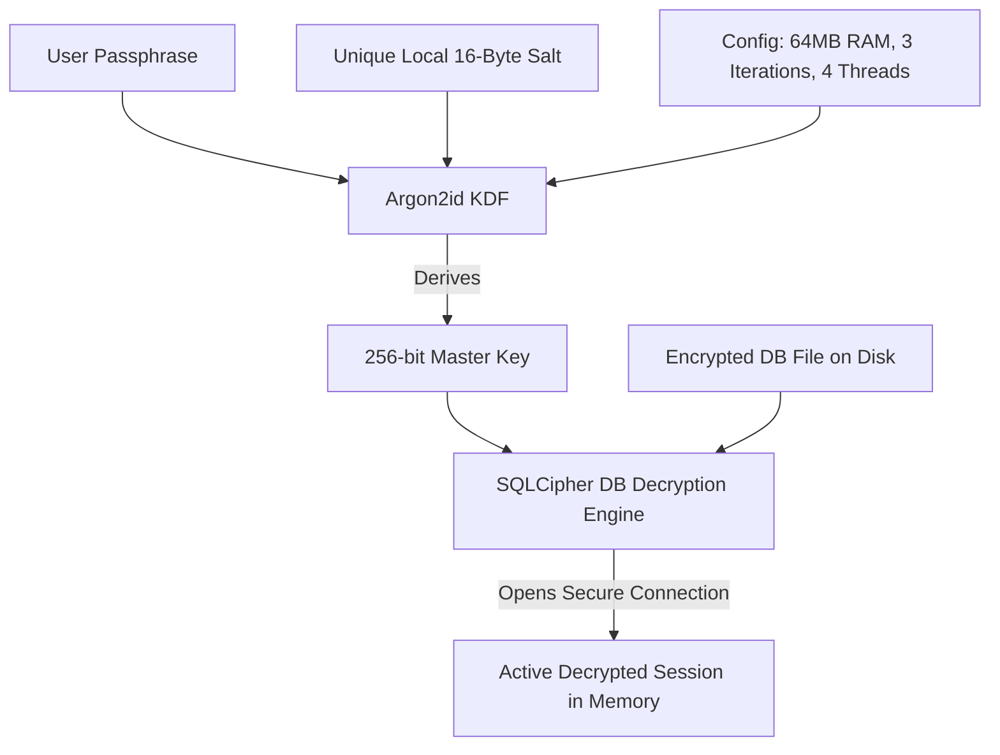
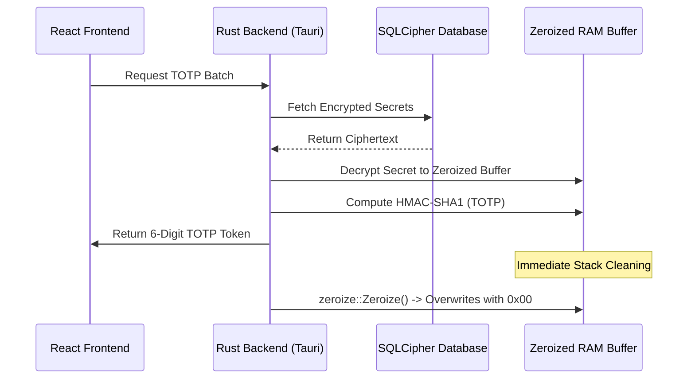
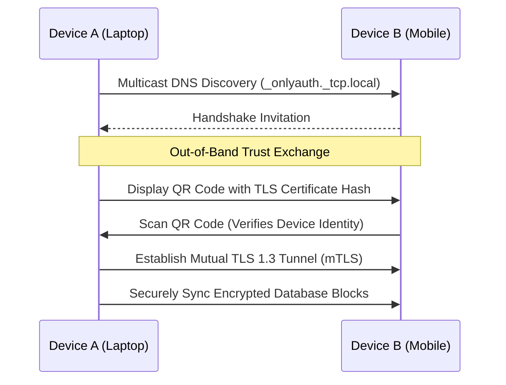

# Only Auth (Under Development)

A local-first, zero-knowledge TOTP/2FA authenticator and credential manager. Built with Tauri v2, React 19, TypeScript, and SQLCipher encryption. All data stays on your device -- no cloud dependencies, no telemetry, no accounts.

> This project is under active development. The frontend TOTP engine, vault management, and import pipeline are functional. Native SQLCipher integration and P2P sync are in progress.

## Features

- **TOTP Code Generation** -- Real-time 6-digit codes using HMAC-SHA1 with 30-second rolling windows. Batched cryptographic engine runs in the Rust backend.
- **Passphrase & Master Key Vault** -- Crypto-wallet-grade mnemonic entropy scheme (12/18/24 words) with a 256-bit hexadecimal master key derived via Argon2id.
- **PIN & Biometric Unlock** -- Optional quick-unlock PIN (4-8 digits) or platform WebAuthn (Face ID / fingerprint). PIN lockout after 5 failed attempts forces passphrase re-entry.
- **Tag-Based Organization** -- Accounts organized by tags (Personal, Work, Finance, Social) instead of separate vaults. Custom tags managed in Settings.
- **Ghost Vault Mode** -- A hidden, passphrase-gated vault layer accessible only through a search-bar trigger. Accounts tagged as "hidden" are invisible until the correct passcode is entered.
- **Import Pipeline** -- Built-in parsers for Google Authenticator migration URIs, Ente Auth JSON exports, and Bitwarden JSON exports.
- **Backup & Restore** -- Single-file encrypted JSON snapshot of the entire vault. Decryptable only with the original passphrase or master key.
- **Compact Mode** -- Density toggle for power users who prefer tighter spacing and smaller fonts.
- **Dark Theme** -- Deep obsidian glassmorphism interface with vibrant cobalt and electric purple accents. High-contrast typography using Geist (display) and Inter (body).
- **Cross-Platform** -- Desktop (Windows, macOS, Linux) via Tauri v2 native webview. The frontend can also be bundled as a web extension (Manifest V3).

## Roadmap

| Phase | Feature | Status |
|-------|---------|--------|
| 1 | UI shell, TOTP generation, account CRUD, import pipeline | Done |
| 2 | Native SQLCipher + Argon2id in Rust backend, vault persistence | In progress |
| 3 | Camera QR scanner, Google Authenticator migration protobuf parser | Pending |
| 4 | P2P Wi-Fi sync via mDNS + mTLS 1.3 (Syncthing-inspired) | Pending |
| 5 | Hardware key wrapping, reproducible builds, audit logging | Pending |

## Tech Stack

| Layer | Technology |
|-------|-----------|
| Desktop Shell | Tauri v2 (Rust) |
| Frontend | React 19, TypeScript, Vite |
| Styling | Tailwind CSS v4 |
| Animation | Motion |
| Icons | Lucide React (SVG only, zero icon libraries) |
| Encryption | SQLCipher (AES-256-CBC + HMAC), Argon2id KDF (pending native Rust integration) |
| TOTP Engine | Custom Rust crate with zeroize memory scrubbing |
| Sync | P2P mDNS + mTLS 1.3 (Syncthing-inspired, pending) |

## Security & Privacy Architecture

Only Auth operates under **Kerckhoffs's Principle** — the system remains secure even if everything about its implementation is public knowledge, so long as the master key remains secret. Below is the core architecture detailing how user privacy and cryptographic integrity are preserved.

### 1. Cryptographic Workflows & Data Flows

#### Workflow A: Master Key Derivation & Vault Access
When you enter your master passphrase, the application derives a 256-bit AES database decryption key on-the-fly. The passphrase itself is never stored on disk.



#### Workflow B: Memory Lifecycle & Ephemeral Decryption (Scrubbing)
To defend against memory scraping, unencrypted TOTP seeds are only kept in RAM for a fraction of a millisecond during HMAC computation and immediately overwritten.



#### Workflow C: Peer-to-Peer (P2P) Wi-Fi Sync Handshake
Device sync operates purely on local-area mesh topology (zero cloud dependencies), utilizing mutual TLS (mTLS) to prevent interception.



---

### 2. Cryptographic Hardening Metrics ("How Secure Is It?")

Only Auth implements modern, high-work-factor cryptographic standards designed to resist both online interception and offline hardware-accelerated attacks:

*   **Offline Brute-Force Immunity (Argon2id):**
    By utilizing Argon2id ($M=64\text{MB}$, $T=3$, $P=4$), local database exfiltration does not result in an immediate break. An attacker trying to guess the master passphrase via GPU clusters (e.g., hashcat) must allocate 64MB of memory per attempt, severely bottlenecks password cracking pipelines, and renders brute force economically and technically infeasible for strong passphrases.
*   **Military-Grade Storage Security (AES-256):**
    Persistent storage is designed to use **SQLCipher (AES-256-CBC with HMAC-SHA512 per page)**. Without the derived key, the database file appears as high-entropy random noise.
*   **Local Network Privacy (TLS 1.3 & mDNS):**
    Sync sessions utilize full TLS 1.3 with peer-verified certificates, ensuring Perfect Forward Secrecy (PFS). Eavesdroppers on the same Wi-Fi network cannot decrypt the sync payload or inject malicious payloads.

---

### 3. What is Left to Make This "Unhackable"? (Core Gaps)

While the architecture is highly secure, several critical implementation gaps must be resolved to achieve full "unhackable" resilience:

1.  **Transition Storage from JSON to SQLCipher (Critical):**
    *   *Current Gap:* The backend storage is temporarily implemented as plaintext JSON (`vault_accounts.json`).
    *   *Production Fix:* Fully integrate `rusqlite` with the `bundled-sqlcipher` feature, moving all data-at-rest to encrypted pages.
2.  **Hardware-Backed Key Wrapping (Critical):**
    *   *Current Gap:* The master key is stored in system memory during active sessions without hardware integration.
    *   *Production Fix:* Integrate platform keystores (macOS Keychain, Windows DPAPI/TPM, Linux Secret Service) to wrap/unwrap the Argon2id salt and derived key.
3.  **Active Clipboard Sweeper & Overlay Protections (High):**
    *   *Current Gap:* Copying TOTP codes to the clipboard exposes them to malware monitoring clipboard changes.
    *   *Production Fix:* Implement an active clipboard clear event that runs 15-30 seconds after copying, and block standard UI overlays.
4.  **mDNS Metadata Blinding (High):**
    *   *Current Gap:* Broadcasters on local subnets advertise their presence via cleartext mDNS.
    *   *Production Fix:* Obfuscate peer discovery identifiers using ephemeral hashed tokens so only paired devices can identify active sync nodes.

---

### 4. Advanced Recommendations to Maximize Robustness

To elevate Only Auth into an industry-leading security fortress, we propose adopting the following best practices:

*   **Argon2id Dynamic Parameter Calibration:**
    Add an intelligent baseline benchmark at startup. Scale the Argon2id memory ($M$) and time ($T$) parameters dynamically based on the device's hardware capacity so that unlocking always takes exactly ~1.0 second—maximizing resistance on high-end hardware without locking out low-spec devices.
*   **PAKE (Password-Authenticated Key Exchange) for P2P Sync:**
    Instead of relying solely on visual QR scans, implement a PAKE protocol (like SPAKE2+ or CPace). This allows secure, zero-knowledge pairing confirmation even over an unencrypted local network using a short, temporary 6-character user-entered code.
*   **Runtime Integrity & Anti-Debugging Shields:**
    Implement anti-debugging hooks in the Rust binary to detect if a debugger (e.g., GDB/LLDB) is attached to the process. If tampering is detected, immediately scrub the RAM memory space and lock the vault.
*   **Fuzz Testing the Migration Protocol Buffer Parsers:**
    Integrate continuous fuzzing (using `cargo-fuzz`) on import parsing pipelines (especially Google Authenticator protobuf schemas) to eliminate buffer overflows or RCE vulnerabilities from maliciously crafted QR codes.

## Getting Started

### Prerequisites

- Bun (runtime and package manager)
- Rust toolchain (for Tauri v2 compilation)

### Development

```bash
# Install dependencies
bun install

# Start the Vite development server (web-only preview)
bun run dev

# Full Tauri desktop build
bunx tauri dev
```

### Production Build

```bash
bun run build
bunx tauri build
```

## Project Structure

```
src/                  React frontend
  App.tsx             Main application component
  components/         Reusable UI components
  types.ts            TypeScript interfaces (Account, AppSettings)
  utils.ts            TOTP engine, vault persistence, helpers
src-tauri/            Rust backend (Tauri v2)
  src/                Rust source with IPC commands, SQLCipher bindings, crypto
  tauri.conf.json     Tauri window and bundle configuration
Plan/                 Architecture documents and specifications
```

## Importing from Other Apps

Only Auth supports importing from:
- **Bitwarden:** Export as JSON, import via Settings > Import & Export > Bitwarden JSON
- **Ente Auth:** Export as decrypted JSON, import via Settings > Import & Export > Ente Auth JSON
- **Google Authenticator:** Scan the migration QR code or paste the `otpauth-migration://` URI

## License

MIT